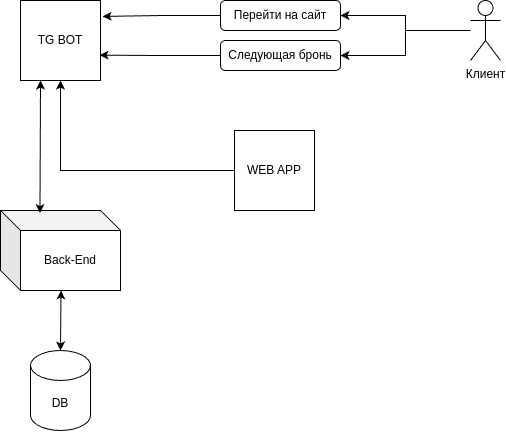

#  FixMaster для клиентов - описание проекта телеграм бота с тремя кнопками: следующая бронь, открытие webapp.

## Цели и задачи 
Целью проекта является создание телеграм бота для упрощения процесса бронирования и взаимодействия с веб-приложением.

# Требования 
## Функцианальные требования

- Кнопка "Следующая бронь" должна отображать информацию о следующей брони.
- Кнопка "Открытие webapp" должна открывать веб-приложение.

## Нефункциональные требования
- Высокая производительность.
- Обеспечение безопасности данных пользователей.

# Архитектура 
## Общая схема

